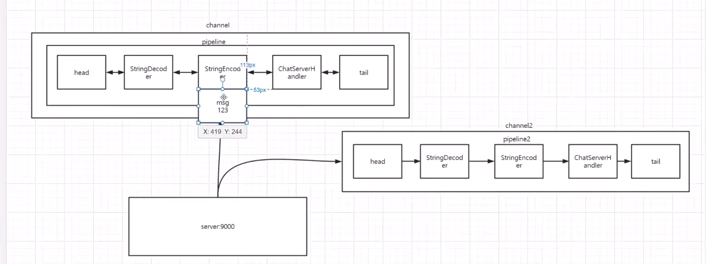

[SDK究竟是什么？ - 知乎 (zhihu.com)](https://zhuanlan.zhihu.com/p/354009139)


[NIO从入门到踹门 (qq.com)](https://mp.weixin.qq.com/s/GfV9w2B0mbT7PmeBS45xLw)

[超详细Netty入门，看这篇就够了！ - 知乎 (zhihu.com)](https://zhuanlan.zhihu.com/p/181239748)

[FileChannel 中 transferFrom 和 transferTo 方法的区别你知道吗 - Demo_Liu - 博客园 (cnblogs.com)](https://www.cnblogs.com/demoliu/p/13954764.html)

什么是nio？什么是netty？nio和netty有什么关系？

nio是一种线程模型，netty是基于nio开发的一款异步事件驱动框架netty简化了nio网络编程的开发。


什么应用场景下会用到netty？

1.开发任何网络编程。实现自己的rpc框架

2.能够作为一些公有协议的broker组件。如mqtt，http。

3.不少的开源软件及大数据领域间的通信也会使用到netty


Netty.底层数据流转的核心-pipeline机制详解



> pipeline 
>
> 传递到服务器的数据会线性的访问所有的pipline，(数据是input的)先会经过StringDecoder(StringDecoder底层也是HandlerAdapter)，然后直接进入ChatServerHandler(因为数据是input的 而StringEncoder则是`ChannelOutboundHandlerAdapter`，不会进入 而是进入后面的HandlerAdapter)。


[面试题：聊聊TCP的粘包、拆包以及解决方案 - 知乎 (zhihu.com)](https://zhuanlan.zhihu.com/p/356225028)

使用py代码 模拟高并发访问聊天室 发现 出现了粘包的现象

```python
import socket

s=socket.socket(socket.AF_INET,socket.SOCK_STREAM)
s.connect(("127.0.0.1",9001))

for i in range(100):
    print(i)
    string="hello1哈"
    body = bytes(string,'gbk')
    s.sendall(body)    
```

针对粘包的解决方案：

1. 发送端将每个包都封装成固定的长度，比如100字节大小。如果不足100字节可通过补0或空等进行填充到指定长度 
   + 缺陷：限制了传输数据大小

```java
 ch.pipeline().addLast(new FixedLengthFrameDecoder(8));
```

2. 发送端在每个包的末尾使用固定的分隔符，例如\r\n。如果发生拆包需等待多个包发送过来之后再找到其中的\r\n进行合并；例如，FTP协议；     
   + 缺陷：在传输数据的内容中无法在出现分隔符

```java
 ch.pipeline().addLast(new DelimiterBasedFrameDecoder(1024, Unpooled.copiedBuffer("_".getBytes())));         
```

```python
for i in range(100):
    print(i)
    string="hello1哈_"
    body = bytes(string,'gbk')
    s.sendall(body)    
```

3. 将消息分为头部和消息体，头部中保存整个消息的长度，只有读取到足够长度的消息之后才算是读到了一个完整的消息；


4. 通过自定义协议进行粘包和拆包的处理

```java
package netty.my.codec;

import io.netty.buffer.ByteBuf;
import io.netty.channel.ChannelHandlerContext;
import io.netty.handler.codec.ByteToMessageDecoder;

import java.util.List;

/**
 * Created with IntelliJ IDEA.
 *
 * @author : hcj
 * @version : 1.0
 * @Project : io-study
 * @Package : netty.my.codec
 * @ClassName : MyDecodecer.java
 * @createTime : 2023/12/14 17:31
 * @Description :
 */
public class MyDecodecer extends ByteToMessageDecoder {

    //数据长度 + 数据
    @Override
    protected void decode(ChannelHandlerContext channelHandlerContext, ByteBuf byteBuf, List<Object> list) throws Exception {
        // 读取数据长度  数据中第一位是数据长度 int长度大于4
        if (byteBuf.readableBytes() < 4) {
            return;
        }
        //数据长度
        int i = byteBuf.readInt();

        // 剩余可读是否小于数据长度
        if (byteBuf.readableBytes()<i){
            // 重置读索引  读取数据失败(即传递数据丢失)时，已经读取了第一位int数据（用来表示数据长度），需要回退
            byteBuf.resetReaderIndex();
            return;
        }
        // 读取数据
        byte[] data = new byte[i];//10000
        byteBuf.readBytes(data);
        System.out.println(new String(data));

        // 标记读索引，下一次读取数据的起点
        byteBuf.markReaderIndex();//10004

    }
}

```

```python
import socket
import uuid

s=socket.socket(socket.AF_INET,socket.SOCK_STREAM)
s.connect(("127.0.0.1",9001))
data = "哈哈哈哈哈哈hcj"
print(data)
dataBytes = bytes(data,"utf-8")
dataLen = len(dataBytes)
# java中int长度为4
data_len = dataLen.to_bytes(4,byteorder="big")

# s.sendall(data_len + dataBytes)

for i in range(100):
    print(i)
    s.sendall(data_len + dataBytes)

```


ByteBuf核心API讲解

```java
package netty.bytebuf;

import io.netty.buffer.Unpooled;

/**
 * Created with IntelliJ IDEA.
 *
 * @author : hcj
 * @version : 1.0
 * @Project : io-study
 * @Package : netty.bytebuf
 * @ClassName : ByteBuf.java
 * @createTime : 2023/12/14 18:14
 * @Description : ByteBuf核心API讲解
 */
public class ByteBuf {
    public static void main(String[] args) {
        // 创建byteBuf对象，该对象内部包含一个字节数组byte[10]
        io.netty.buffer.ByteBuf byteBuf = Unpooled.buffer(10);
        System.out.println("byteBuf=" + byteBuf);

        for (int i = 0; i < 8; i++) {
            byteBuf.writeByte(i);
        }
        System.out.println("byteBuf=" + byteBuf);

        for (int i = 0; i < 5; i++) {
            System.out.println(byteBuf.getByte(i));
        }
        System.out.println("byteBuf=" + byteBuf);

        for (int i = 0; i < 5; i++) {
            System.out.println(byteBuf.readByte());
        }
        System.out.println("byteBuf=" + byteBuf);

    }
}
```

> byteBuf.getByte() 能够读取到数据 ，但是不会更新读索引
> byteBuf.readByte() 能够读取到数据 ，同时会更新读索引


**长连接和短链接**

长连接：a和b连接起来，传递完数据后还会一直保持连接

> 长连接的维持需要心跳机制

短链接：a和b连接起来，传递完数据后 直接断开连接


[TCP心跳检测-CSDN博客](https://blog.csdn.net/m0_47984232/article/details/108253344)


[用大白话解释什么是Socket - 知乎 (zhihu.com)](https://zhuanlan.zhihu.com/p/260139078)

[socket是什么？套接字是什么？ - 知乎 (zhihu.com)](https://zhuanlan.zhihu.com/p/230800627)

[什么是Socket连接？它与TCP连接有什么关系？ - 知乎 (zhihu.com)](https://zhuanlan.zhihu.com/p/609049345)

[带你了解TCP/IP，UDP，Socket之间关系 - 知乎 (zhihu.com)](https://zhuanlan.zhihu.com/p/355739010)


移动端的即时通信和pc端的即时通信相比，移动端的无线网络没有pc端的稳定，移动端的硬件也没有pc端的发达导致完整的移动端即时通讯架构设计和实现充满着很大的挑战


**文本协议**： （http协议 所有基于文本协议的协议）

+ 可读性好，便于调试
+ 扩展性好(通过key：value扩展)
+ 解析效率一般


**二进制协议**  （ip协议）

进制协议的特点是一段的传输内容里，其中的固定某一位或者几位表示固定的意思。

> 例如 固定的第一位 固定的表示本次传输数据长度

+ 扩展性不好（设计的好可以规避
+ 可读性差，难于调试
+ 解析效率高


**xml协议** （也是基于文本协议）

+ 它是准标准协议，可以跨域互通
+ XML的优点，可读性好，扩展性好
+ 解析代价高
+ 有效数据传输率超低（大量的标签）


**mqtt协议 **  基于二进制的协议

+ 优点：适配多平台。相比xmpp，数据包更小。
+ 缺点：协议简单，公有协议无法自定义一些数据格式。


**私有协议**  基于二进制的协议

+ 优点：随心所欲，定制化强，流量小。
+ 缺点：工作量巨大，扩展性差，需要考虑全面。


[详解消息中间件及其应用场景和常用消息中间件的技术选型（RabbitMQ、Kafka 、RocketMQ、ActiveMQ）_消息中间件技术选型-CSDN博客](https://blog.csdn.net/qq_42937522/article/details/113868219)


[面试官：为什么要用这个注册中心？ - 知乎 (zhihu.com)](https://zhuanlan.zhihu.com/p/462081330)

+ 在本项目中重点是 数据的一致性 和 分区容忍性 系统中的任意信息丢失都不会影响系统的正常运行 正好和zookeeper(cp)吻合

[ZooKeeper 详解 - 知乎 (zhihu.com)](https://zhuanlan.zhihu.com/p/72902467)

[ZooKeeper 入门看这篇就够了 - 知乎 (zhihu.com)](https://zhuanlan.zhihu.com/p/98852358)


